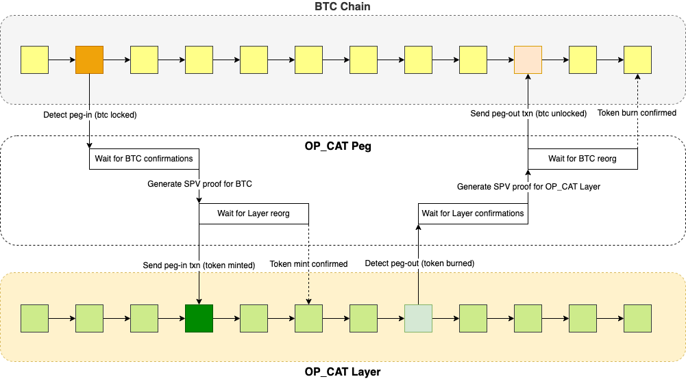

# OP_CAT Peg: A Trustless Two-Way Bridge

The OP_CAT Peg introduces a revolutionary trustless two-way bridge between Bitcoin’s base layer and the OP_CAT Layer, addressing a decade-old "holy grail" challenge in Bitcoin’s ecosystem. By leveraging Simplified Payment Verification (SPV) proofs, it enables secure, on-chain peg-in and peg-out operations without custodians or third-party dependencies. The two-way peg is the linchpin of the OP_CAT Layer, enabling secure, trustless asset movement from and to Bitcoin’s main chain. It consists of a peg-in process (locking bitcoins on the main chain to mint OP_CAT Layer assets) and a peg-out process (redeeming OP_CAT Layer assets back to bitcoins), with OP_CAT playing a pivotal role.

The diagram illustrates the complete process of transferring funds between Bitcoin and the OP_CAT Layer through the trustless two-way OP_CAT Peg implemented with SPV proofs. 

**The peg-in process** begins with a peg-in transaction where BTC is locked (orange block). The OP_CAT Peg detects this transaction and waits for sufficient Bitcoin confirmations before generating an SPV proof. This proof signals the OP_CAT Layer to mint corresponding tokens (green block), which are confirmed after a Layer reorganization wait period, completing the peg-in process.

**The peg-out process** reverses this flow. The diagram demonstrates the permissionless, decentralized nature of the system, with the OP_CAT Peg facilitating secure asset movement using SPV proofs without requiring intermediaries.

Since `OP_CAT` is not yet activated on Bitcoin mainnet, we have decided to launch the OP_CAT Layer bridge in two phases:

## Phase-1: Before `OP_CAT` is enabled on Bitcoin

A secured multi-signature solution will be employed, based on [Safeheron](https://safeheron.com/) services and other open-source, production-ready industry components. Every peg-in and peg-out transaction will be verified and signed by core ecosystem participants.

## Phase-2: After `OP_CAT` is enabled on Bitcoin

The peg-in and peg-out processes will transition to a smart contract-based solution as described above, achieving a truly trustless two-way bridge.