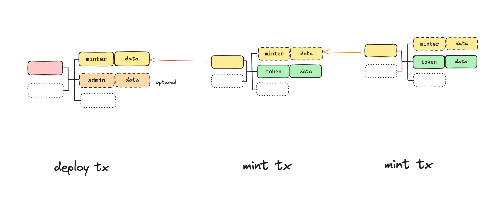
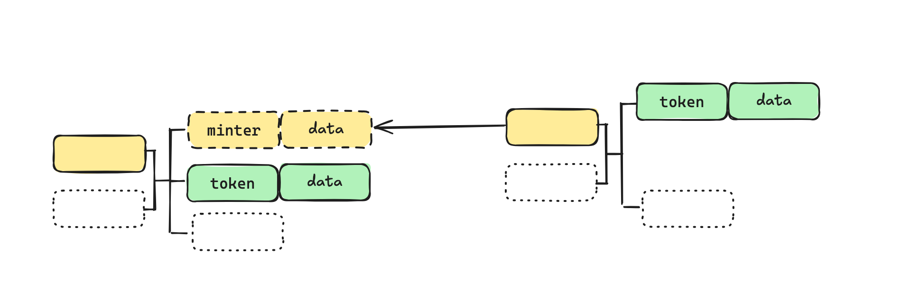
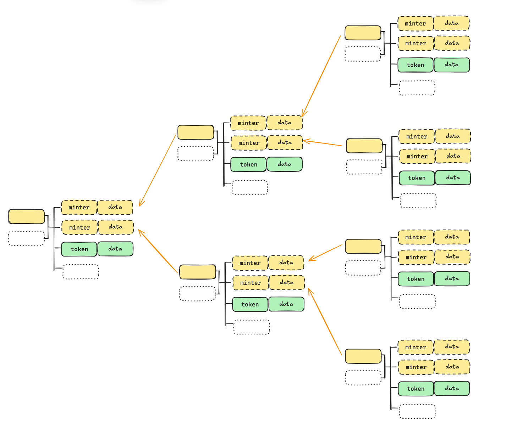

# CAT20 Specification

# 1. Deploy

To deploy a token, we need send 2 transactions. We call the first transaction the token `genesis transaction`, and the second the `deploy transaction`. In the data field of the an output of the `genesis transaction`, we include a `CAT` envelope to embed token meta information. The byte sequence `cat` (`0x636174` in hex) signifies that this envelope is part of the `CAT` Protocol.

```
OP_PUSH "cat"
OP_PUSH 1	    // fungible token
OP_PUSH 5       // metadata tag
OP_PUSH <JSON>  // CBOR encoded
```

The JSON file must contain the following fields:

```
{
  "name": "cat",
  "symbol": "CAT",
  "decimals": "2",
}
```

JSON is [CBOR](https://cbor.io/) encoded. If it is longer than pushdata limit of 520 bytes, it is split into multiple chunks and is concatenated before decoding. More fields can be added for customized metadata.

The transactions must follow the following rules to be valid:

- There is one and only one envelope in the genesis transaction outputs.
- There are one or more minter outputs of the same script in deploy transaction, nothing else. Note that a change output is forbidden1. After deployment, the token is uniquely identified by the token meta information output in the genesis transaction. tokenId consists of the genesis transaction txid and output index with the following formatting: txid_vout.

:::note
Token names/symbols are not unique and anyone can deploy a token with the same name/symbol with a previously deployed token, as in [ERC20](https://ethereum.org/developers/docs/standards/tokens/erc-20/).
:::

# 2. Mint

Any rules governing the minting process of a token are enforced in its minter smart contract. New tokens can be minted by spending a minter UTXO in the token deploy transaction. It can generate new minter UTXOs, which in turn can be spent to mint more tokens recursively. New tokens can only be issued by spending minter UTXOs. A mint transaction must follow the following rules to be valid:

- There is exactly one minter input
- There is exactly one token output
- The token output must be right after a minter output, if any. Note there can be zero and multiple minter outputs.



Compared to indexer-enforced token minting, minting CAT20 tokens can be flexibly customized by programming its minter contract, as long as it follows the rules above. The token issuer can define arbitrary minting rules without any change to the underlying protocol, unlike indexer-based protocols. Some use cases include:

- only mintable if certain amount of bitcoins are paid to a given address
- only mintable starting from a given time or block height
- only mintable if proof of work is demonstrated, as in mining Bitcoin but with lower difficulty
- only mintable by holders of a certain different token
- only mintable if some bitcoins are time-locked: the more coins, the longer time locked, the more tokens can be minted

## Open and closed mint

An `open` mint (also called `permissionless` mint) refers to a token issuance process where anyone can participate in minting new tokens. The creator of the token specifies parameters such as the total supply and mint limit per transaction, which the minter smart contract enforces. This is similar to [BRC-20](https://domo-2.gitbook.io/brc-20-experiment).

## Premine

Open and closed minting are not mutually exclusive. For example, the minter contract can require an issuer signature only for the first few mints, but not for subsequent mints. This allows preallocation of a certain number of tokens before the token minting is open to the public, i.e., a premine.

## Limited supply

More tokens can be minted after the initial mint transaction, by consuming and creating minter UTXOs repeatedly. In cases where a fixed supply is desired, the last mint creates **no** new minter UTXOs. Relinquishing the minting ability creates a provably limited supply token.


## Parallel mint

If there is only one minter UTXO for a token and there are multiple users trying to mint this token by spending it, only one of them will succeed and all others will fail. This contention is likely to occur in an open mint. To alleviate this, a mint transaction can create multiple (say **`N`**) minter UTXOs. We call the parameter `**N**` the `concurrency` of token minting. It allows an exponentially growing number of minter UTXOs as minting progrosses. By judiciously selecting UTXOs, contention can be drastically reduced as shown below where `N = 2`. All mint transactions form a tree rooted at the reveal transaction, instead of a chain where `N = 1` and mints have to be sequential.



# 3. Transfer

A fungible token (FT) UTXO can be split into small amounts. Multiple token UTXOs can be merged into a single UTXO, if only they descend from the same genesis transaction. In general, there can be multiple token inputs and token outputs in a token transfer transaction, and they can appear anywhere in the transaction. The preservation of token balance is enforced by miners: the quantity of tokens in the inputs must equal that in the outputs.

import cat20Transfer1 from '../../../static/img/token/cat20-transfer-1.png';


Different types of tokens can be transferred in the same transaction. Each token’s balance is preserved. The following example shows two different types of tokens transferred in a single transaction.

import cat20Transfer2 from '../../../static/img/token/cat20-transfer-2.png';


# 4. Burn

Tokens can be burned and their lineage from the genesis is terminated. The satoshis stored in their UTXOs are melted to a regular non-covenant address, effectively “uncolored”.

import cat20Burn1 from '../../../static/img/token/cat20-burn-1.png';


