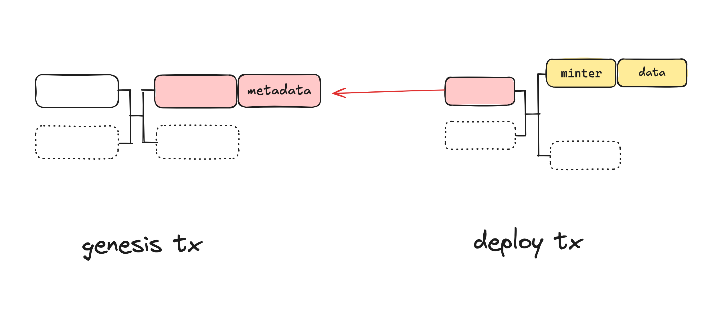
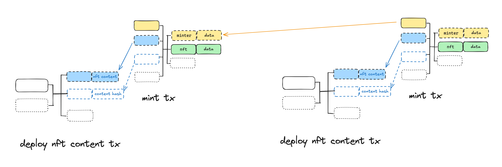
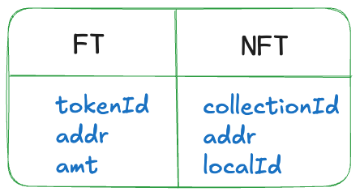

Unlike [CAT20](./cat20) tokens, CAT721 tokens cannot be divided into smaller units. Each token is unique and non-interchangeable, i.e., non-fungible. Each NFT stores **full data on-chain immutably** using Bitcoin transactions.

# 1. Deploy


To mint any non-fungible token (NFT), a collection has to be deployed first. All NFTs descending from a genesis transaction fall under its collection. **Provenance** is on chain and enshrined in the protocol. It is publicly accessible by any party and does not rely on off-chain data.

Similar to CAT20, the collection information is embedded in a CAT envelope, but with a different tag.

```
OP_PUSH "cat"
OP_PUSH 2 // collection
OP_PUSH 5 // metadata tag
OP_PUSH <JSON>   // CBOR encoded
```

The JSON file contains collection-level metadata, which must at least contain the following:

```json
{
  "name": "lockedcat",
  "symbol": "LockedCAT"
}
```

The `collectionId` is defined as the genesis outpoint `txid_vout`, same as CAT20 `tokenId`. The deploy transaction must follow the same rule as in CAT20.

## Fields

An envelope may contain other fields. Each field is composed of a tag and a corresponding value. At present, the following tags have been defined:

- 0: content
- 1: MIME type of the content
- 5: metadata
- 9: encoding of the content
- 11: delegate of the content

## Royalties

Collection creator can optionally include royalty payment information in the metadata field, like

```json
{
  "receiver": "1A1zP1eP5QGefi2DMPTfTL5SLmv7DivfNa", // address of who should be sent the royalty payment
  "royaltyPercent": "10" // the royalty payment amount as a percentage of sale price
}
```

The NFT marketplace ecosystem can **voluntarily** adopt a standardized royalty payment system shown above, which is NOT enforced on chain. This helps to establish a sustainable revenue stream for artists and content creators. Potential NFT buyers will likely consider the royalty structure as a significant factor in their decision-making process when purchasing.

# 2. Mint

Each individual NFT within a collection can be minted by spending a minter UTXO as in CAT20. The minter contract and the corresponding mint transaction must follow the same rules as in CAT20 mints, with two additional rules:

- There is one and only one envelope in the genesis transaction outputs. The envelope is associated with the freshly minted NFT in the output. It contains all the metadata of the NFT. This input is different from the input that spends a previous minter output.
- Each NFT must have a local ID unique within the collection.



Each NFT is inscribed in an envelope similar to [Ordinals](https://docs.ordinals.com/inscriptions.html) with a different tag.

```
OP_PUSH "cat"
OP_PUSH 3	// NFT
OP_PUSH 0
OP_PUSH content
```

Optional [fields](#fields) can be added before content, which is also optional.

:::note
Inscription is bound to a particular UTXO in CAT721, not a particular satoshi as in Ordinals.
:::

Globally, each individual NFT will be referenced by a unique ID: `collectionId:localId`, i.e., `txid_vout:localId`. A CAT20/FT and CAT721/NFT output has the following contract state, respectively:



Same as in CAT20, arbitrary minting rules can be programmed and enforced in a CAT721 minting contract, such as open mint and limited supply.

# 3. Transfer

An NFT can be transferred from an input to an output, i.e., from one UTXO to another. Only the owner address field of the state is updated.

import cat721Transfer1 from '../../../static/img/token/cat721-transfer-1.png';


## Batch Transfer

Multiple NFTs, in the same or different collections, can be transferred in a single transaction. The set of NFTs in the inputs must equate that in the outputs, regardless of ordering. The following example shows two NFTs transferred together.

import cat721Transfer2 from '../../../static/img/token/cat721-transfer-2.png';


# 4. Burn

An NFT owner can destroy and burn it, permanently removing it from a collection. Multiple NFTs can be burned in a single transaction.

import cat721Burn1 from '../../../static/img/token/cat721-burn-1.png';

