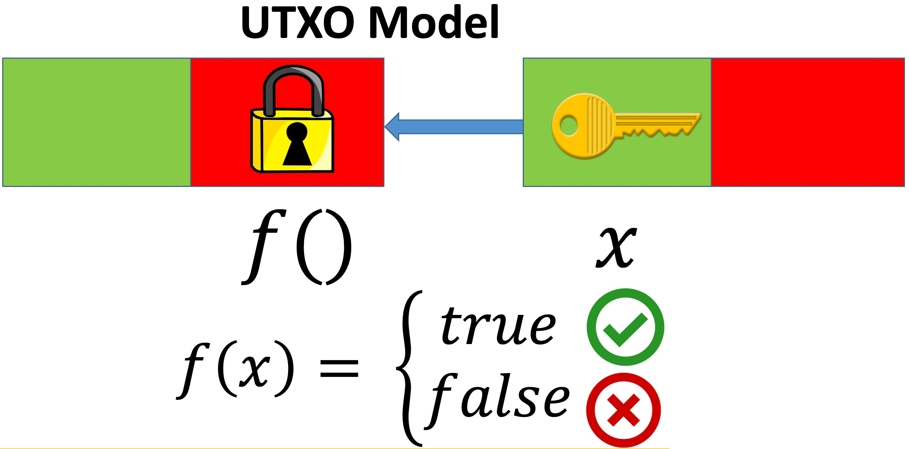

An Unspent Transaction Output (UTXO) is a transaction output that has not yet been consumed by any subsequent transaction. The underlying low-level bytecode/opcode language is called [Bitcoin Script](https://learnmeabitcoin.com/technical/script/), which is interpreted by the Bitcoin Virtual Machine (BVM).

In the example above, we have two transactions, each with one input (shown in green) and one output (shown in red). The transaction on the right spends the output from the transaction on the left.
The locking script can be regarded as a boolean function `f` that specifies conditions to spend the bitcoins in the UTXO, acting as a lock (thus the name "locking").
The unlocking script in turns provides the function arguments that makes `f` evaluates to `true`, i.e., the "key" (also called witness) needed to unlock.
Only when the “key” in an input matches previous output’s “lock”, it can spend bitcoins contained in the output.

In a regular Bitcoin payment to a [Bitcoin address](https://learnmeabitcoin.com/technical/keys/address/), the locking script uses [Pay To Pubkey Hash (P2PKH)](https://learnmeabitcoin.com/technical/p2pkh). This script verifies that the spender possesses the correct private key corresponding to the address, enabling them to produce a valid signature in the unlocking script. The expressive nature of Bitcoin Script allows locking scripts to specify arbitrarily complex spending conditions beyond simple P2PKH — essentially enabling Bitcoin smart contracts.
