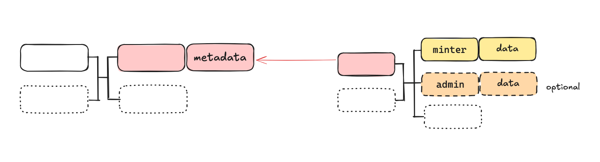
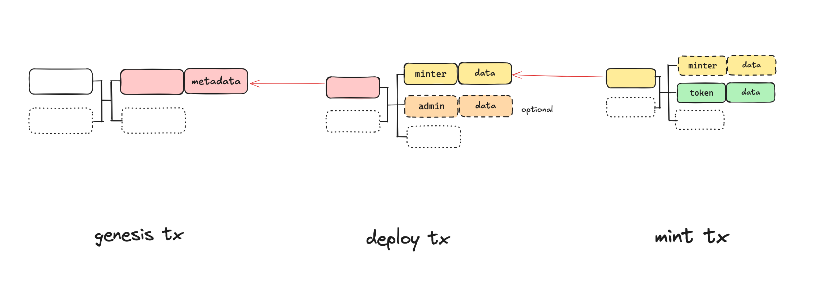
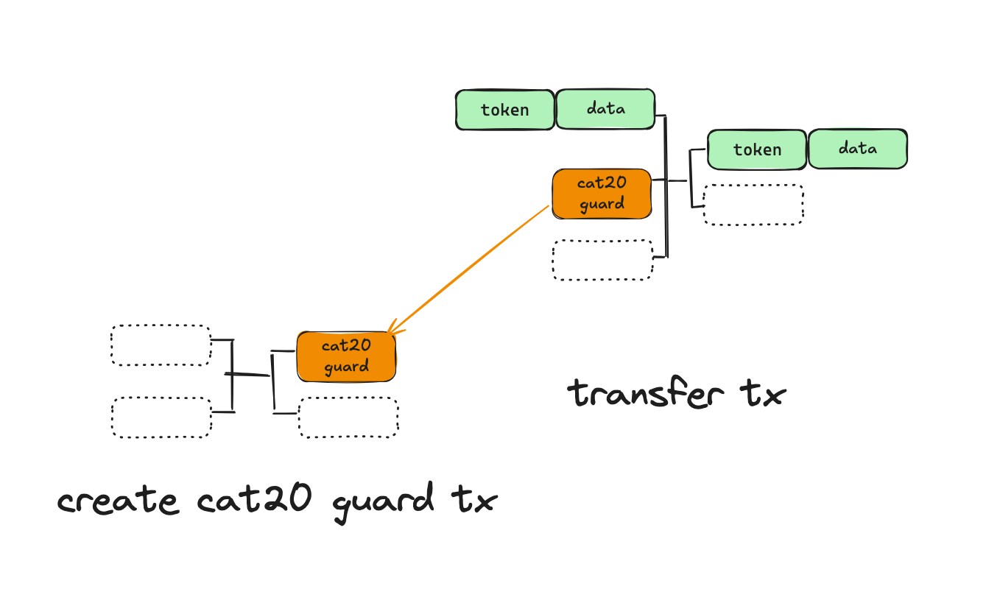
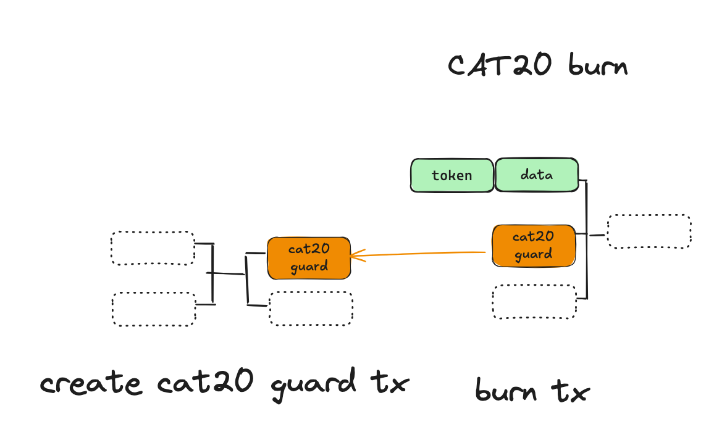

# CAT20

CAT20 standard is a part of the CAT protocol which supports fungible tokens. As you all know, CAT is a UTXO-based token protocol that is validated by miners directly and uses smart contracts, specifically covenants, to manage token mints and transfers. It is solely enforced by Bitcoin Script at Layer 1 and has several benefits compared with all the existing token protocols on Bitcoin.

# Deploy

## Feature API

To deploy a new CAT20 token, you can easily call the corresponding feature in the SDK.

for deploying a CAT20 token using `CAT20OpenMinter` contract, call `deployOpenMinterToken`

```ts
/**
 * Deploys a CAT20 token and its metadata using `CAT20OpenMinter` contract, and premines the token if applicable.
 * The preimner can mint the token with premined amount first, other users can mint the token with a fixed amount later
 * @param signer a signer, such as {@link DefaultSigner}  or {@link UnisatSigner}
 * @param utxoProvider a  {@link UtxoProvider}
 * @param chainProvider a  {@link ChainProvider}
 * @param metadata the metadata of the CAT20 token
 * @param feeRate the fee rate for constructing transactions
 * @param changeAddress the address to receive change satoshis, use the signer address as the default
 * @returns the genesis transaction, the token reveal transaction and the premine transaction
 */
function deployOpenMinterToken(
  signer: Signer,
  utxoProvider: UtxoProvider,
  chainProvider: ChainProvider,
  metadata: OpenMinterCat20Meta,
  feeRate: number,
  changeAddress?: string
): Promise<
  Cat20TokenInfo<OpenMinterCat20Meta> & {
    genesisTx: ExtPsbt;
    revealTx: ExtPsbt;
    premineTx?: ExtPsbt;
  }
>;
```

for deploying a CAT20 token using `CAT20ClosedMinter` contract, call `deployClosedMinterToken`

```ts
/**
 * Deploys a CAT20 token and its metadata using `CAT20ClosedMinter` contract
 * Only the token issuer can mint token
 * @param signer the signer for the deployer and issuer
 * @param provider the provider for the blockchain and UTXO operations
 * @param metadata the metadata for the token
 * @param feeRate the fee rate for the transaction
 * @param changeAddress the address for the change output
 * @returns the token info and the PSBTs for the genesis and deploy transactions
 */
function deploy(
  signer: Signer,
  provider: ChainProvider & UtxoProvider,
  metadata: ClosedMinterCAT20Meta,
  feeRate: number,
  changeAddress?: string
): Promise<
  CAT20TokenInfo<ClosedMinterCAT20Meta> & {
    genesisPsbt: ExtPsbt;
    deployPsbt: ExtPsbt;
  }
>;
```

## Design

To deploy a token, we need send 2 transactions. We call the first transaction the token `genesis transaction`, and the second the `deploy transaction`. In the data field of the an output of the `genesis transaction`, we include a `CAT` envelope to embed token meta information.



# Mint

## Feature API

To mint CAT20 tokens, you can call the corresponding feature in the SDK:

for minting a CAT20 token using `CAT20OpenMinter` contract, call `mintOpenMinterToken`

```ts
/**
 * Mints a CAT20 token using `CAT20OpenMinter` contract
 * The preimner can mint the token with premined amount first, other users can mint the token with a fixed amount later
 * @param signer the signer for the minting
 * @param preminerSigner the signer for the preminer, pass the deployer signer if premine is disabled, otherwise pass the reminer signer
 * @param provider the provider for the blockchain and UTXO operations
 * @param minterUtxo the UTXO of the minter contract
 * @param tokenId the ID of the token
 */
export async function mintOpenMinterToken(
  signer: Signer,
  preminerSigner: Signer,
  provider: UtxoProvider & ChainProvider,
  minterUtxo: UTXO,
  tokenId: string,
  metadata: OpenMinterCAT20Meta,
  tokenReceiver: ByteString,
  changeAddress: string,
  feeRate: number
): Promise<{
  mintPsbt: ExtPsbt;
  mintTxid: string;
}>;
```

for minting a CAT20 token using `CAT20ClosedMinter` contract, call `mintClosedMinterToken`

```ts
/**
 * Mints a CAT20 token using `CAT20ClosedMinter` contract
 * Only the token issuer can mint token
 * @param signer the signer for the issuer
 * @param provider the provider for the blockchain and UTXO operations
 * @param minterUtxo the UTXO of the minter contract
 * @param tokenId the ID of the token
 * @param tokenReceiver the address to receive the token
 * @param tokenAmount the amount of the token to mint
 * @param changeAddress the address for the change output
 * @param feeRate the fee rate for the transaction
 * @returns the mint Psbt and the UTXO of the minted token
 */
export async function mint(
  signer: Signer,
  provider: ChainProvider & UtxoProvider,
  minterUtxo: UTXO,
  tokenId: string,
  tokenReceiver: ByteString,
  tokenAmount: CAT20_AMOUNT,
  changeAddress: string,
  feeRate: number
): Promise<{
  mintPsbt: ExtPsbt;
  cat20Utxo: UTXO;
  mintTxId: string;
}>;
```

## Design

All minting rules for a token are enforced in its minter smart contract. New tokens are minted by spending a minter UTXO that was first generated in the token reveal transaction. This process can generate new minter UTXOs, which can then be spent to mint more tokens recursively.

The minter UTXOs are consumed and regenerated throughout the minting process, ensuring that new tokens can only be issued by spending these designated minter UTXOs.



# Send

## Feature API

To send CAT20 tokens, you can call the corresponding feature in the SDK:

```ts
/**
 * Sends a CAT20 token using `CAT20Guard` contract
 * @param signer the signer for the sender
 * @param provider the provider for the blockchain and UTXO operations
 * @param adminScriptHash the script hash of the admin contract
 * @param minterScriptHash the script hash of the minter contract
 * @param inputTokenUtxos the UTXOs of the input tokens
 * @param receivers the receivers of the tokens and the amounts
 * @param tokenChangeAddress the address for the change output
 * @param feeRate the fee rate for the transaction
 * @param sendChangeData the change data for the transaction
 * @returns the PSBTs for the guard and send transactions, the UTXOs of the new tokens, and the index of the change token output
 */
export async function singleSendToken(
  signer: Signer,
  provider: UtxoProvider & ChainProvider,
  adminScriptHash: ByteString,
  minterScriptHash: ByteString,
  inputTokenUtxos: UTXO[],
  receivers: Array<{
    address: ByteString;
    amount: CAT20_AMOUNT;
  }>,
  tokenChangeAddress: ByteString,
  feeRate: number,
  sendChangeData?: Buffer
): Promise<{
  guardPsbt: ExtPsbt;
  sendPsbt: ExtPsbt;
  sendTxId: string;
  guardTxId: string;
  newCAT20Utxos: UTXO[];
  changeTokenOutputIndex: number;
}>;
```

## Design

A fungible token (FT) UTXO can be split into smaller amounts, and multiple token UTXOs can be merged into a single UTXO if they descend from the same genesis transaction. A token transfer transaction can contain multiple token inputs and outputs, which can appear anywhere in the transaction.

Token balance preservation is enforced by miners: the quantity of tokens in the inputs must equal that in the outputs. A guard input `cat20Guard` in the transfer transaction ensures this balance. The Transfer Guard contract can only be unlocked when the token amount remains unchanged between transaction inputs and outputs.

Guard contracts can be customized for different scenarios, allowing you to implement various token amount limitations. This modular approach separates token amount verification logic into a dependent contract rather than hard-coding it directly in the token protocol.



# Burn

## Feature API

To burn CAT20 tokens, you can call the corresponding feature in the SDK:

```ts
/**
 * Burns a CAT20 token using `CAT20Guard` contract
 * @param signer the signer for the burner
 * @param provider the provider for the blockchain and UTXO operations
 * @param adminScriptHash the script hash of the admin contract
 * @param minterScriptHash the script hash of the minter contract
 * @param inputTokenUtxos the UTXOs of the input tokens
 * @param feeRate the fee rate for the transaction
 * @returns the PSBTs for the guard and burn transactions
 */
export async function burn(
  signer: Signer,
  provider: UtxoProvider & ChainProvider,
  adminScriptHash: ByteString,
  minterScriptHash: ByteString,
  inputTokenUtxos: UTXO[],
  feeRate: number
): Promise<{
  guardPsbt: ExtPsbt;
  burnPsbt: ExtPsbt;
  guardTxid: string;
  burnTxid: string;
}>;
```

# Design

When tokens are burned, their lineage from the genesis is terminated. The satoshis stored in their UTXOs are "melted" to a regular non-covenant address, effectively "uncoloring" them.



The token burning process is similar to a token transfer, but with the key difference that the tokens are permanently removed from circulation rather than changing ownership.

# Freeze

## Feature API

To freeze CAT20 tokens, you can call the corresponding feature in the SDK:

```ts
/**
 * Freeze CAT20 tokens in a single transaction.
 * @param signer a signer, such as {@link DefaultSigner} or {@link WalletSigner}
 * @param cat20Admin a CAT20Admin {@link CAT20Admin}
 * @param adminUtxo a utxo of cat20Admin {@link UTXO}
 * @param provider a  {@link UtxoProvider} & {@link ChainProvider}
 * @param minterScriptHash the minter script hash of the CAT20 token
 * @param adminScriptHash the admin script hash of the CAT20 token
 * @param inputTokenUtxos CAT20 token utxos to be sent
 * @param feeRate the fee rate for constructing transactions
 * @returns the guard transaction, the freeze transaction.
 */
export async function freeze(
  signer: Signer,
  cat20Admin: CAT20Admin,
  adminUtxo: UTXO,
  provider: UtxoProvider & ChainProvider,
  minterScriptHash: string,
  adminScriptHash: string,
  inputTokenUtxos: UTXO[],
  feeRate: number
): Promise<{
  guardPsbt: ExtPsbt;
  sendPsbt: ExtPsbt;
  sendTxId: string;
  guardTxId: string;
  newCAT20Utxos: UTXO[];
  changeTokenOutputIndex: number;
}>;
```

## Design

Tokens can be frozen using an admin contract, which allows the token issuer to temporarily restrict the transfer of specific tokens when necessary.


# TransferOwnership

## Feature API

To transfer the owner address of the CAT20 admin contract, you can call the corresponding feature in the SDK:

```ts
/**
 * Change CAT20 admin owner in a single transaction.
 * @param signer a signer, such as {@link DefaultSigner} or {@link WalletSigner}
 * @param cat20Admin a CAT20Admin {@link CAT20Admin}
 * @param adminUtxo a utxo of cat20Admin {@link UTXO}
 * @param provider a  {@link UtxoProvider} & {@link ChainProvider}
 * @param newAddress a new admin owner address
 * @param feeRate the fee rate for constructing transactions
 * @returns a transferOwnership transaction
 */
export async function transferOwnership(
  signer: Signer,
  cat20Admin: CAT20Admin,
  adminUtxo: UTXO,
  provider: UtxoProvider & ChainProvider,
  newAddress: ByteString,
  feeRate: number
): Promise<{
  sendPsbt: ExtPsbt;
  sendTxId: string;
}>;
```

## Design

The ownership transfer feature allows the current owner of the token's admin contract to transfer administrative rights to another address. This enables secure handover of token management capabilities while maintaining the token's integrity and continuity.


