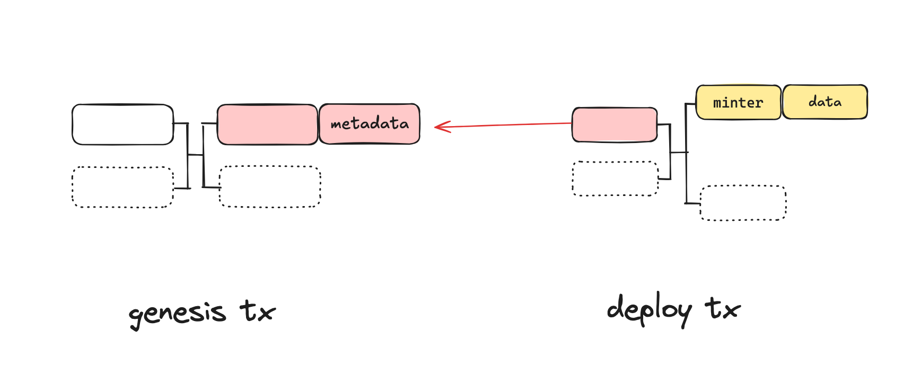
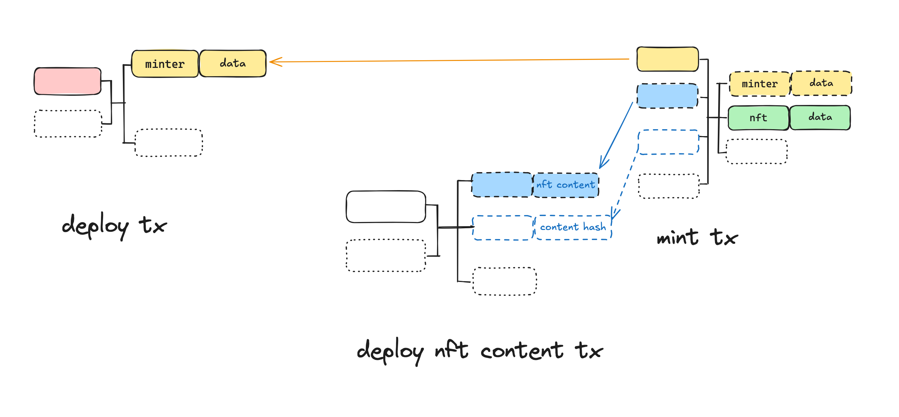
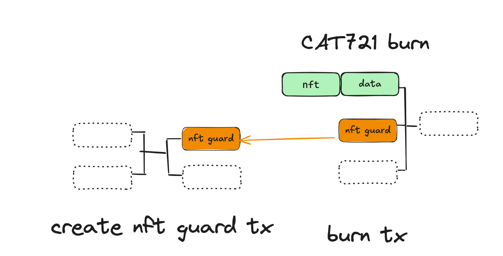

# CAT20

CAT721 standard is a part of the CAT protocol, which supports non-fungible tokens. Unlike CAT20 tokens, CAT721 tokens cannot be divided into smaller units. Each token is unique and non-interchangeable, i.e., non-fungible. Each NFT stores full data on-chain immutably using Bitcoin transactions.

# Deploy

## Feature API

`cat-sdk` provides a deploy feature to deploy CAT721.

for deploying a CAT721 token using `CAT721OpenMinter` contract, call `deployOpenMinterCollection`

```ts
/**
 * Deploys a CAT721 open minter and its metadata using `CAT721OpenMinter` contract
 * @param signer the signer for the deployer
 * @param provider the provider for the blockchain and UTXO operations
 * @param metadata the metadata for the collection
 * @param initMerkleRoot the initial merkle root for the collection
 * @param feeRate the fee rate for the transaction
 * @param changeAddress the address for the change output
 * @returns the collection info and the PSBTs for the genesis and deploy transactions
 */
export async function deployOpenMinterCollection(
  signer: Signer,
  provider: UtxoProvider & ChainProvider,
  metadata: OpenMinterCAT721Meta,
  initMerkleRoot: ByteString,
  feeRate: number,
  changeAddress?: string
): Promise<
  CAT721NftInfo<OpenMinterCAT721Meta> & {
    genesisPsbt: ExtPsbt;
    deployPsbt: ExtPsbt;
    minter: CAT721OpenMinter;
  }
>;
```

for deploying a CAT721 token using `CAT721ClosedMinter` contract, call `deployClosedMinterCollection`

```ts
/**
 * Deploys a CAT721 closed minter and its metadata using `CAT721ClosedMinter` contract
 * Only the token issuer can mint token
 * @param signer the signer for the deployer
 * @param provider the provider for the blockchain and UTXO operations
 * @param metadata the metadata for the collection
 * @param feeRate the fee rate for the transaction
 * @param content the content for the collection
 * @param changeAddress the address for the change output
 * @returns the collection info and the PSBTs for the genesis and deploy transactions
 */
export async function deployClosedMinterCollection(
  signer: Signer,
  provider: UtxoProvider & ChainProvider,
  metadata: ClosedMinterCAT721Meta,
  feeRate: number,
  content?: {
    type: string;
    body: string;
  },
  changeAddress?: string
): Promise<
  CAT721NftInfo<ClosedMinterCAT721Meta> & {
    genesisPsbt: ExtPsbt;
    deployPsbt: ExtPsbt;
    minterUtxo: UTXO;
  }
>;
```

## Design

To deploy a cat721 token, we need send 2 transactions. We call the first transaction the cat721 token `genesis transaction`, and the second the `deploy transaction`. In the data field of the an output of the `genesis transaction`, we include a `CAT` envelope to embed cat721 token meta information.



# Mint

cat-sdk provides a mint feature to mint the CAT721 token.

## Feature API

To mint CAT721 tokens, you can call the corresponding feature in the SDK:

for minting a CAT721 token using `CAT721OpenMinter` contract, call `mintOpenMinterNft`

```ts
/**
 * Mints a CAT721 NFT using `CAT721OpenMinter` contract
 * @param signer the signer for the minting
 * @param provider the provider for the blockchain and UTXO operations
 * @param minterUtxo the UTXO of the minter contract
 * @param proof the proof for the merkle root
 * @param proofNodePos the position of the proof node
 * @param nextMerkleRoot the next merkle root
 * @param nft the nft to mint
 * @param collectionId the id of the collection
 * @param metadata the metadata and content for the nft
 * @param nftReceiver the address to receive the nft
 * @param changeAddress the address for the change output
 * @param feeRate the fee rate for the transaction
 * @returns the PSBTs for the create and mint transactions
 */
export async function mintOpenMinterNft(
  signer: Signer,
  provider: UtxoProvider & ChainProvider,
  minterUtxo: UTXO,
  proof: MerkleProof,
  proofNodePos: ProofNodePos,
  nextMerkleRoot: ByteString,
  nft: {
    contentType: string;
    contentBody: string;
    nftmetadata: object;
  },
  collectionId: string,
  metadata: OpenMinterCAT721Meta,
  nftReceiver: ByteString,
  changeAddress: string,
  feeRate: number
): Promise<{
  createNftPsbt: ExtPsbt;
  createNftTxId: string;
  mintPsbt: ExtPsbt;
  mintTxId: string;
}>;
```

for minting a CAT721 token using `CAT721ClosedMinter` contract, call `mintClosedMinterNft`

```ts
/**
 * Mints a CAT721 NFT using `CAT721ClosedMinter` contract
 * Only the token issuer can mint token
 * @param issuerSigner the signer for the issuer
 * @param feeSigner the signer for the fee
 * @param provider the provider for the blockchain and UTXO operations
 * @param minterUtxo the UTXO of the minter contract
 * @param nft the nft to mint
 * @param collectionId the id of the collection
 * @param metadata the metadata and content for the nft
 * @param nftReceiver the address to receive the nft
 * @param changeAddress the address for the change output
 * @param feeUtxos the UTXOs for the fee
 * @param feeRate the fee rate for the transaction
 * @returns the PSBTs for the create and mint transactions
 */
export async function mintClosedMinterNft(
  issuerSigner: Signer,
  feeSigner: Signer,
  provider: UtxoProvider & ChainProvider,
  minterUtxo: UTXO,
  nft: {
    contentType: string;
    contentBody: string;
    nftmetadata: object;
  },
  collectionId: string,
  metadata: ClosedMinterCAT721Meta,
  nftReceiver: ByteString,
  changeAddress: string,
  feeUtxos: UTXO[],
  feeRate: number
): Promise<{
  createNftPsbt: ExtPsbt;
  createNftTxId: string;
  mintPsbt: ExtPsbt;
  mintTxId: string;
}>;
```

## Design

Before minting an NFT, the contentType, contentBody, and metadata of the NFT must first be deployed. Find a minter UTXO, unlock it. Unlocking the minter will create a cat721 token UTXO, thereby completing the token minting.



# Send

## Feature API

cat-sdk provides send feature to send CAT721 token.

```ts
/**
 * Sends a CAT721 NFT using `CAT721Guard` contract
 * @param signer the signer for the sender
 * @param provider the provider for the blockchain and UTXO operations
 * @param minterScriptHash the script hash of the minter contract
 * @param inputNftUtxos the UTXOs of the input tokens
 * @param nftReceivers the receivers of the tokens
 * @param feeRate the fee rate for the transaction
 * @returns the PSBTs for the guard and send transactions, the UTXOs of the new tokens
 */
export async function singleSendNft(
  signer: Signer,
  provider: UtxoProvider & ChainProvider,
  minterScriptHash: ByteString,
  inputNftUtxos: UTXO[],
  nftReceivers: ByteString[],
  feeRate: number
): Promise<{
  guardPsbt: ExtPsbt;
  sendPsbt: ExtPsbt;
  guardTxId: string;
  sendTxId: string;
  newNftUtxos: UTXO[];
}>;
```

## Design

`CAT721` is the main contract for implementing tokens. It is responsible for checking the following contents:

Check if the transaction context is correct.
Check the current CAT721 token status
Trace the token to make sure it comes from genesis
Check if guards are spent at the same time
Check ownership, if the token is held by a private key, check the signature, if the token is held by a contract, check whether the contract holding the token has been spent
`CAT721Guard` ensures that tokens are transferred correctly.

Check if the transaction context is correct.
Check the current guard status
Parse the nft localId to be transferred from preState, and transfer them according to the requirements of ownerAddrOrScriptList, localIdList and nftOutputMaskList.


# Burn

## Feature API

To burn CAT721 tokens, you can easily call the corresponding feature in the SDK.

```ts
/**
 * Burns a CAT721 NFT using `CAT721Guard` contract
 * @param signer the signer for the burner
 * @param provider the provider for the blockchain and UTXO operations
 * @param minterScriptHash the script hash of the minter contract
 * @param inputNftUtxos the UTXOs of the input tokens
 * @param feeRate the fee rate for the transaction
 * @returns the PSBTs for the guard and burn transactions
 */
export async function burnNft(
  signer: Signer,
  provider: UtxoProvider & ChainProvider,
  minterScriptHash: ByteString,
  inputNftUtxos: UTXO[],
  feeRate: number
): Promise<{
  guardPsbt: ExtPsbt;
  burnPsbt: ExtPsbt;
  guardTxid: string;
  burnTxid: string;
}>;
```

## Design

Just as the burning schema for CAT20 tokens can be applied to CAT721 tokens. However, it’s important to note that you should use a `CAT721Guard` specifically designed for burning CAT721 tokens.


