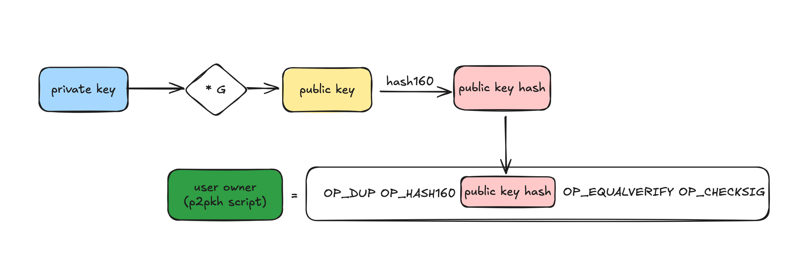
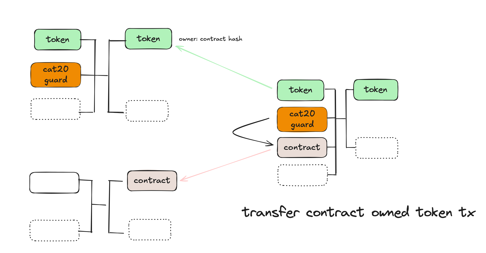
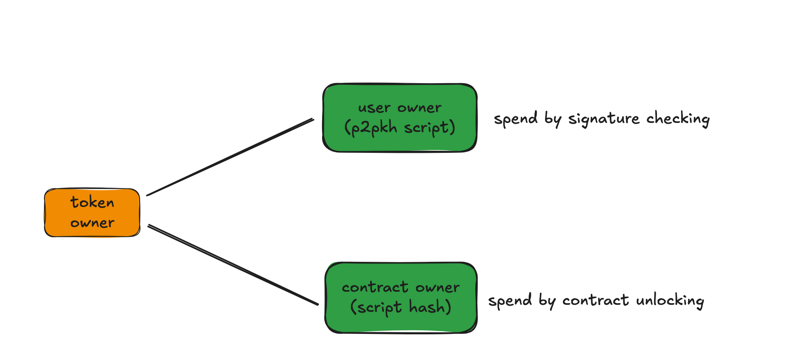

# Contract Owned Token

Each token UTXO has an owner address. It is essentially p2pkh script, corresponding to a private key. When the owner sends the token, she signs with the private key, which the token contract checks, the same way as sending bitcoins locked in a regular P2PKH address.

There is an alternative path to spend the token: script hash or contract hash. In this path, the script hash is the sha256 hash of output script.

Tokens can be deposited to a contract hash. It is not controlled by anyone but the contract, since there is no corresponding private key. This is similar to a smart contract account in Ethereum, which also does not have a corresponding private key, unlike an Externally Owned Account (EOA). To transfer the tokens, the CAT token contract ensures there must be a neighboring input in the same transaction, spending a UTXO with the owner contract address (shown by the red arrow). The contract can inspect and place constraints on the transaction using covenant, thus enforce additional transfer rules.

In summary, there are two options to spend a token UTXO

1. check p2pkh signature
2. unlock the contract

We can now use option 2 to send existing tokens to arbitrary smart contracts. The contract does not have to be known when tokens are minted and can be developed by a third party independently. This means CAT tokens are infinitely extensible and interoperable with decentralized applications, such as decentralized exchanges and atomic swaps.
