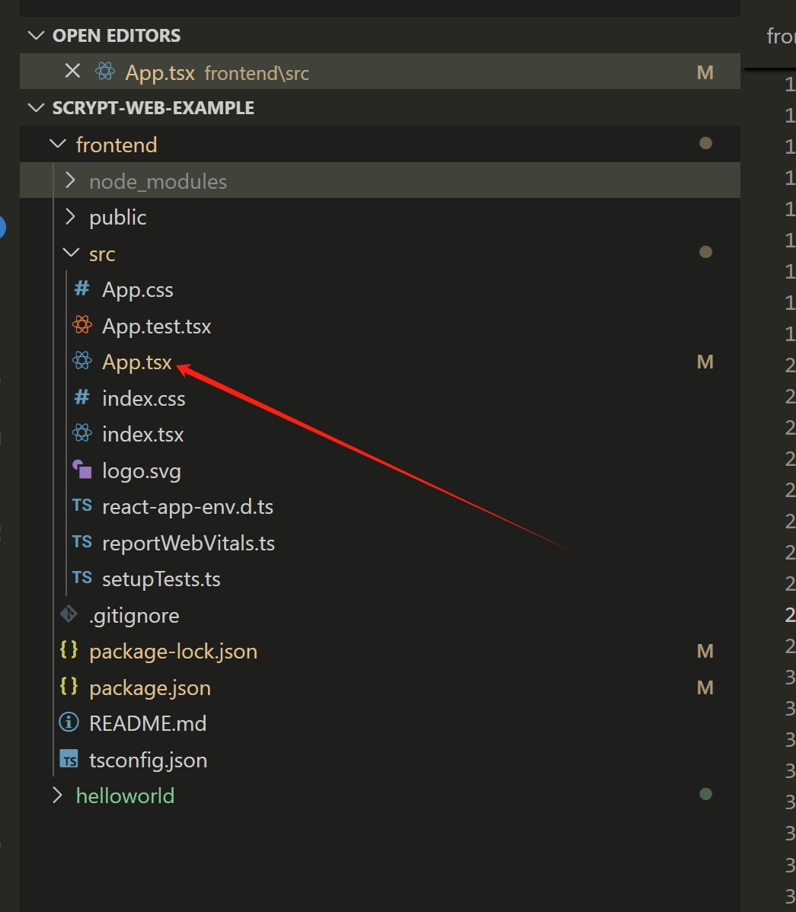
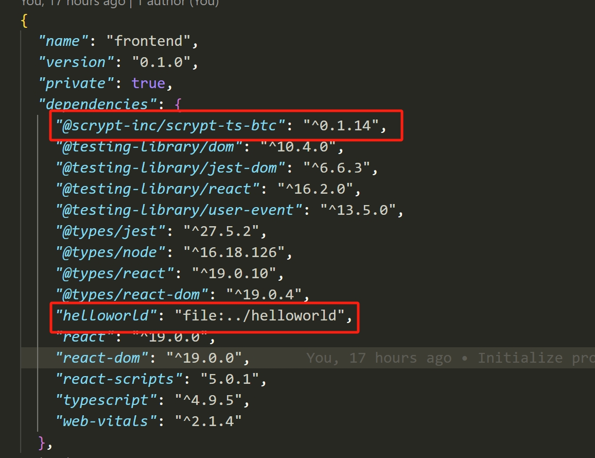

# Front-end Integration

This section will show how to integrate your smart contract to a front-end, so users can interact with it.
We assume that you already have the basic knowledge of front-end development, so we will not spend much time introducing this part of the code, but mostly be focusing on how to interact with the smart contract in the front-end project.

## Create a project

First, create the root directory of the project.

```bash
mkdir scrypt-web-example
cd scrypt-web-example
```

### Create a contract project

Create a `Helloworld` project and build it:

```bash
npx @opcat-labs/cli-opcat project helloworld
cd helloworld
npm run build
```

See the [helloworld tutorial](../tutorials/hello-world.md)

### Create a frontend project


Create your front-end project using React, Next, Vue, Angular, or Svelte.

### React

Run the following command to create a [React](https://react.dev/) project named `helloworld`.

```bash
cd ..
npx create-react-app frontend --template typescript
```



We will do most work under the `src` directory.

### Next.js

Run the following command to create a [Next.js](https://nextjs.org/) project.

```bash
npx create-next-app frontend --typescript --use-npm
```

### Vue.js

#### Vite

Run the following command to create a [Vue](https://vuejs.org/) 3.x project bundled with [Vite](https://vitejs.dev/).

```bash
npm create vue@3
```

If you'd like to use Vue 2.x, run the following command to initialize the project scaffold.

```bash
npm create vue@2
```

#### Webpack

Run the following command to create a [Vue](https://vuejs.org/) project bundled with [Webpack](https://webpack.js.org/).

```bash
npx @vue/cli create frontend
```

:::tip
Vue 3.x and 2.x bundled with Webpack are both supported.
:::

When setting up the project, select `Manually select features` and enable TypeScript.

### Angular

Run the following command to create an [Angular](https://angular.io/) project.

```bash
npx @angular/cli new frontend
```

### Svelte

Run the following command to create a [Svelte](https://svelte.dev/) project.

```bash
npm create svelte@latest frontend
```

:::note
Currently, we support front-end frameworks [React](https://react.dev), [Next.js](https://nextjs.org/), [Vue](https://vuejs.org/), [Angular](https://angular.io/), and [Svelte](https://svelte.dev/). We anticipate to add support for other frameworks over time.
:::

## Install the contract dependency

```bash
cd frontend
npm install @opcat-labs/scrypt-ts-opcat
npm install ../helloworld
```

This command installs the dependencies and configures the contract development environment.
After this, we are ready to go!


