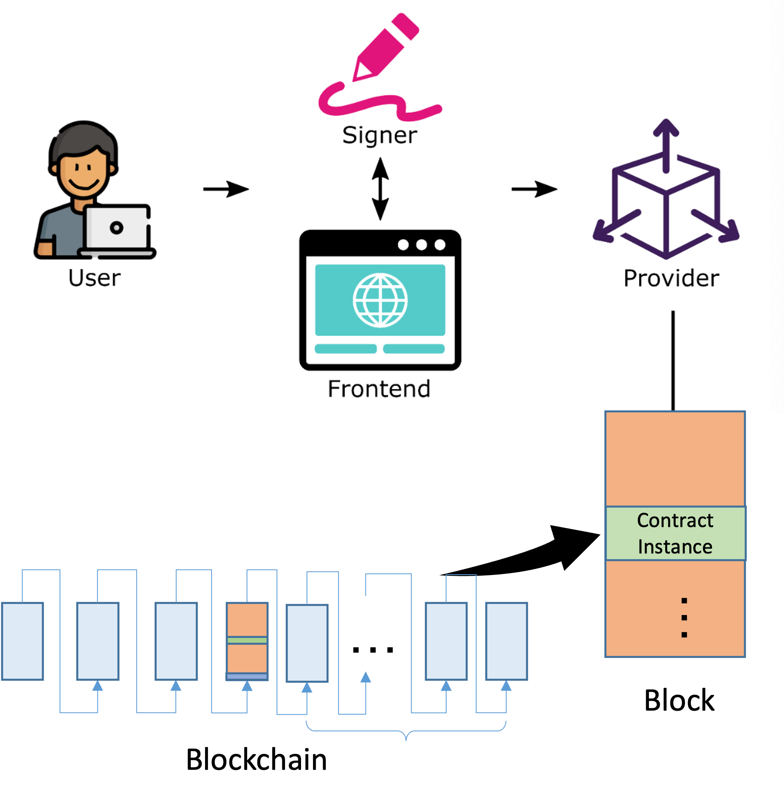

# How to Deploy & Call a Contract


## Core Concepts
After you've finished writing a contract, you can deploy and call it. But first, you should learn how a smart contract interacts with the blockchain. In this section, we will go over some fundamental concepts in detail.


[Credit: moonbeam](https://docs.moonbeam.network/tutorials/eth-api/how-to-build-a-dapp)

### Compile and Load Contract

First, compile the contract using the CLI:
```ts
npx @opcat-labs/cli-opcat compile
```
This will create an artifact json file of your contract in the `/artifacts` folder.

Next, call [loadArtifact](../how-to-write-a-contract/built-ins.md#loadartifact) to load the json file, so you have a smart contract class ready to be instantiated.
```ts
import artifact from '../artifacts/mycontract.json'
MyContract.loadArtifact(artifact)
```


### Provider

A `Provider` is an abstraction of a standard node that provides connection to the blockchain network, for read and write access to the blockchain.

sCrypt already has a few built-in providers:

* `DummyProvider`: A mockup provider just for local tests. It does not connect to the blockchain and thus cannot send transactions.

* `MempoolProvider`:  The default provider is the safest, easiest way to begin developing on Mempool API, and it is also robust enough for use in production. It can be used in testnet as well as mainnet.

* `RPCProvider`:  The default provider is the safest, easiest way to begin developing on OP_CAT Layer RPC API, and it is also robust enough for use in production. It can be used in testnet as well as mainnet.

You can initialize these providers like this:

```ts
let dummyProvider = new DummyProvider('opcat-testnet);

// testnet
let provider = new MempoolProvider('opcat-testnet');

// mainnet
let provider = new MempoolProvider('opcat-mainnet');


// rpc
let provider = new RPCProvider('opcat-testnet', 'http://127.0.0.1:8883', 'myWallet', 'username', 'password');
```

### Signer

A `Signer` is an abstraction of private keys, which can be used to sign messages and transactions. A simple signer would be a single private key, while a complex signer is a wallet.

#### DefaultSigner

For testing purposes only, we have a built-in wallet called `DefaultSigner`. It can be created like this:

```ts
const key = PrivateKey.fromRandom(Networks.mainnet);
const signer = new DefaultSigner(key);
```


#### Contract Deployment Transaction

A transaction is required when deploying a contract to the blockchain. The transaction should have an output, whose script is compiled from the contract. This output is known as a contract UTXO and the contract instance comes from this UTXO.

#### Contract Call Transaction

When you call a public method of a contract instance in a UTXO, a call transaction is needed. The transaction has an input that references to the UTXO and contains the script consisting of the method's arguments. We regard the contract instance goes to this transaction input.

This section could be summarized as the diagram below:


## Prepare a Signer and Provider

A signer and a provider must be created before deployment and call. When we are ready to deploy the contract to the testnet/mainnet, we need a real provider like [DefaultProvider](#provider).

```ts
import {MempoolProvider, DefaultSigner, Networks, PrivateKey } from "@opcat-labs/scrypt-ts-opcat";

const provider = new MempoolProvider('opcat-testnet');
const signer = new DefaultSigner(PrivateKey.fromRandom(Networks.testnet))
```

The `privateKey` must have enough coins. Learn how to fund it on a testnet using a [faucet](./faucet).


:::note
`DefaultSigner` is just a `Signer` provided by sCrypt for testing. In a real production environment (mainnet), you should use  `UnisatSigner` or others.
:::

## Contract Deployment

To deploy a smart contract, call its `deploy` method, like this:

```ts
// construct a new instance of `MyContract`
let instance = new MyContract(...initArgs);

// the contract UTXO’s satoshis
const initBalance = 1234;

// build and send tx for deployment
const deployPsbt = await deploy(signer, provider, instance, initBalance);
console.log(`Smart contract successfully deployed with txid ${deployPsbt.extractTransaction().id}`);
```

## Contract Call

To facilitate calling a contract's public `@method`, we have injected a runtime object named `methods` in your contract class, just call the contract's `public` method in the `invokeMethod` callback.

Assume you have a contract like this:

```ts
class MyContract extends SmartContract {
  ...
  @method()
  public foo(arg1, arg2) {...}
}

let instance = new MyContract();
```

This function is designed to invoke the corresponding `@method` of the same name on chain, meaning: calling it will spend the previous contract UTXO in a new transaction. You can call it like this:

```ts
const tx = await call(
    signer, 
    provider, 
    instance, 
    (contract: MyContract) => {
        contract.foo(arg1, arg2);        
    }
)
```

What actually happens during the call is the following:

1. Build an unsigned psbt by calling the tx builder for a public `@method`.
2. Use the signer to sign the psbt. Note that `contract.foo` could be invoked during this process in order to get a valid unlocking script for the input.
3. Use the `provider` to send the transaction.


### Method with Signatures

A contract public `@method` often needs a signature argument for authentication. Take this [Pay To PubKey Hash (P2PKH)](https://learnmeabitcoin.com/technical/p2pkh) contract for example:

```ts
import { assert, SmartContract, method, pubKey2Addr, Addr, prop, Sig, PubKey } from "@opcat-labs/scrypt-ts-opcat";

export class P2PKH extends SmartContract {
  @prop()
  readonly address: Addr

  constructor(address: Addr) {
      super(...arguments)
      this.address = address
  }

  @method()
  public unlock(sig: Sig, pubkey: PubKey) {
      // make sure the `pubkey` is the one locked with its address in the constructor
      assert(pubKey2Addr(pubkey) == this.address, 'address check failed')

   // make sure the `sig` is signed by the private key corresponding to the `pubkey`
      assert(this.checkSig(sig, pubkey), 'signature check failed')
  }
}
```

We can call the `unlock` method like this:

```ts
// call
const address = await testSigner.getAddress();
const callPsbt = await call(
  signer, 
  provider, 
  contract,
  (p2pkh: P2PKH, psbt: IExtPsbt) => {
    // getSig to find a signature
    const sig = psbt.getSig(0, { address: address });
    p2pkh.unlock(sig, PubKey(pubkey));
  }
)

console.log('contract called: ', callPsbt.extractTransaction().id);
```

When `psbt.getSig` is called, the option contains `address`, requesting a signature against `address`.

The secound argument is a signature, which can be obtained in a callback function. The function takes a list of signatures requested in `address` and find the one signature to the right public key/address.

In general, if your `@method` needs `Sig`-typed arguments, you could obtain them as follows:

1. Ensure the first argument is right input index;
1. Ensure that the options contains all public keys/addresses corresponding to these `Sig`s;

## Example

Here is the complete sample code for the deployment and call of a P2PKH contract.

```ts
import { P2PKH } from '../src/contracts/p2pkh'
import * as dotenv from 'dotenv'
import { getDefaultProvider, getDefaultSigner } from './utils/txHelper';
import { call, deploy, hash160, IExtPsbt, PubKey } from '@opcat-labs/scrypt-ts-opcat';

// note: run npx @opcat-labs/cli-opcat compile to generate artifacts
import p2pkhArtifact from '../artifacts/contracts/p2pkh.json'
// Load the .env file
dotenv.config()

async function main() {


    P2PKH.loadArtifact(p2pkhArtifact)


    // setup signer
    const signer = getDefaultSigner();
    
    // setup provider
    const provider = getDefaultProvider();
    
    // initialize an instance with `pkh`
    const address = await signer.getAddress();
    const pubkey = await signer.getPublicKey();
    const pkh = hash160(pubkey);
    
    const p2pkh = new P2PKH(pkh)
    
    // deploy the contract, with 1 satoshi locked in
    const deployTx = await deploy(signer, provider, p2pkh);
    console.log('P2PKH contract deployed: ', deployTx.extractTransaction().id);
    
    // call
    const callTx = await call(
        signer, 
        provider, 
        p2pkh, 
        (p2pkh: P2PKH, psbt: IExtPsbt) => {
            const sig = psbt.getSig(0, { address: address });
            p2pkh.unlock(sig, PubKey(pubkey));
        }
    )
    
    console.log('P2PKH contract called: ', callTx.extractTransaction().id);

}


main();
```

### Running the code

The deployment and call code is wrapped into a simple NPM command:

```sh
npx tsx testP2pkh.ts
```

Make sure you fund your address before running this command.
After a successful run you should see something like:

```
P2PKH contract deployed:  9c7d9442c51881e60d9c4cb3d06ac3849df532855b7ab6f60bdd6369cd2a0a9f
P2PKH contract called:  ef07b9d7909d8abb716f5385c7b4d518883444d8bd4491ddb6b3173e26741adc
```

These are the TXIDs of the transaction which deployed the smart contract and then the one which called its method. You can see the transactions using a [block explorer](https://testnet.opcatlabs.io/tx/9c7d9442c51881e60d9c4cb3d06ac3849df532855b7ab6f60bdd6369cd2a0a9f).
