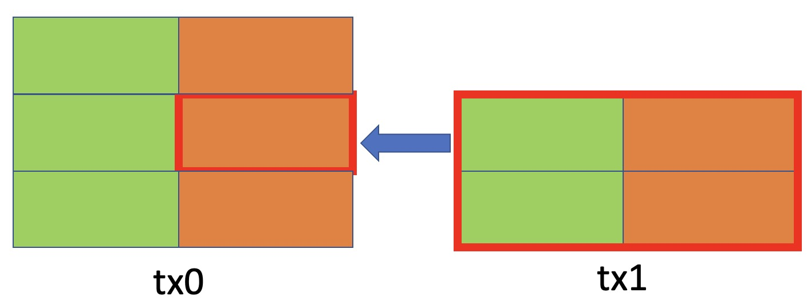

# Script Context

In the UTXO model, the context of validating a smart contract is the UTXO containing it and the transaction spending it, including its inputs and outputs. In the following example, when the second of input of transaction `tx1` (2 inputs and 2 outputs) is spending the second output of `tx0` (3 inputs and 3 outputs), the context for the smart contract in the latter output is roughly the UTXO and `tx1` circled in red.



The context only contains local information.
This is different from account-based blockchains (like Ethereum) where context consists of the global state of the entire blockchain.
A single shared global state across all smart contracts jeopardizes scalability because transactions must be sequentially processed, resulting in potential race conditions.

This context is expressed in the `ScriptContext` interface.

```ts


/**
 * An bytestring refers to the outputs from previous transactions that are being spent as inputs in the current transaction.
 * prevout = prevTxHash(32 bytes) + prevOutputIndex(4 bytes)
 * prevouts1 + prevouts2 + ... + prevoutsN
 * @category Types
 * @onchain
 */
export type Prevouts = ByteString;

/**
 * The context of the spent scripts.
 * spentScriptHash = scriptHash(32 bytes)
 * spentScriptHash1 + spentScriptHash2 + ... + spentScriptHashN
 * @category Types
 * @onchain
 */
export type SpentScriptHashes = ByteString;

/**
 * The context of the spent data hashes.
 * spentDataHash = dataHash(32 bytes)
 * spentDataHash1 + spentDataHash2 + ... + spentDataHashN
 * @category Types
 * @onchain
 */
export type SpentDataHashes = ByteString;

/**
 * The context of the spent amounts.
 * spentAmount = amount(8 bytes)
 * spentAmount1 + spentAmount2 + ... + spentAmountN
 * @category Types
 * @onchain
 */
export type SpentAmounts = ByteString;


/**
 * The context of the ScriptContext.
 * @note: currently, we only support the basic sighash type(sighash_all), other sighash types are not supported.
 * @todo: support other sighash types, like sighash_single, sighash_none,...
 */
export type ScriptContext = {
  /**
   * 4 bytes.
   * version number of the transaction
   */
  nVersion: ByteString;

  /**
   * 32 bytes.
   * hash256(prevout0 + prevout1 + ... + prevoutN)
   */
  hashPrevouts: ByteString;

  /**
   * 32 bytes.
   * current input's prevout script hash, SHA256
   */
  spentScriptHash: ByteString

  /**
   * 32 bytes.
   * current input's prevout data hash, SHA256
   */
  spentDataHash: ByteString;

  /**
   * 8 bytes little endian. spent amount;
   */
  value: UInt64;

  /**
   * 4 bytes little endian.
   */
  nSequence: ByteString;

  /**
   * 32 bytes.
   * hash256(spentAmount0(8 bytes, little endian) + spentAmount1 + ... + spentAmountN)
   */
  hashSpentAmounts: ByteString;

  /**
   * 32 bytes.
   * hash256(spentScriptHash0(32 bytes) + spentScriptHash1 + ... + spentScriptHashN)
   */
  hashSpentScriptHashes: ByteString;

  /**
   * 32 bytes.
   * hash256(spentDataHash0(32 bytes) + spentDataHash1 + ... + spentDataHashN)
   */
  hashSpentDataHashes: ByteString;

  /**
   * 32 bytes.
   * hash256(sequence0(4 bytes, little endian) + sequence1 + ... + sequenceN)
   */
  hashSequences: ByteString;

  /**
   * 32 bytes.
   * hash256(output0(value(8 bytes, little endian) + scriptHash(32 bytes) + dataHash(32 bytes)) + output1 + ... + outputN)
   */
  hashOutputs: ByteString;

  /**
   * 4 bytes little endian.
   */
  inputIndex: UInt32;

  
  /**
   * 4 bytes little endian.
   */
  nLockTime: UInt32;

  /**
   * 4 bytes little endian.
   */
  sigHashType: UInt32


  
  /**
   * @type {UInt32}
   * input count of the current transaction
   */
  inputCount: UInt32;
  
  /**
   * @type {Outpoint}
   * The outpoint of the current input.
   */
  prevout: Outpoint;

  
  /**
   * @type {Prevouts}
   * prevouts is an array of the previous outpoints.
   */
  prevouts: Prevouts;

  /**
   * @type {SpentScripts}
   *
   */
  spentScriptHashes: SpentScriptHashes;

  /**
   * @type {SpentAmounts}
   *
   */
  spentAmounts: SpentAmounts;

  /**
   * @type {SpentDataHashes}
   */
  spentDataHashes: SpentDataHashes;
};

```

You can directly access the context through `this.ctx` in any public `@method`. It can be considered additional information a public method gets when called, besides its function parameters.

The example below accesses the spentScript of the spending transaction. 

```ts
import { assert, ByteString, method, SmartContract, TxUtils, UInt64 } from '@opcat-labs/scrypt-ts-opcat';

export class Clone extends SmartContract {
  constructor() {
    super();
  }

  @method()
  public unlock() {
    // make sure balance in the contract does not change

    const script = this.ctx.spentScriptHash
    const amount: UInt64 = this.ctx.value


    // output containing the latest state
    const output: ByteString = TxUtils.buildOutput(script, amount);
    // verify current tx has this single output
    assert(this.checkOutputs(output), 'Outputs mismatch with the transaction context')
  }
}
```

## Access inputs and outputs

The inputs and outputs of the spending transaction are not directly included in `ScriptContext`, but their hashes/digests. To access them, we can build them first and validate the hash to the expected digest, which ensures they are actually from the spending transaction.

The following example ensures both Alice and Bob get 1000 satoshis from the contract.

```ts


import { method, prop, SmartContract, assert, Addr, ByteString, TxUtils } from '@opcat-labs/scrypt-ts-opcat';

export class DesignatedReceivers extends SmartContract {
    @prop()
    readonly alice: Addr

    @prop()
    readonly bob: Addr

    constructor(alice: Addr, bob: Addr) {
        super(...arguments)
        this.alice = alice
        this.bob = bob
    }

    @method()
    public payout() {
        const aliceOutput: ByteString = TxUtils.buildP2PKHOutput(1000n, this.alice)
        const bobOutput: ByteString = TxUtils.buildP2PKHOutput(1000n, this.bob)
        let outputs = aliceOutput + bobOutput

        // require a change output
        outputs += this.buildChangeOutput();

        // ensure outputs are actually from the spending transaction as expected
        assert(this.checkOutputs(outputs), 'Outputs mismatch with the transaction context')
    }
}
```

### Debugging

See [How to Debug ScriptContext Failure](../advanced/how-to-debug-scriptcontext.md)
