# CAT20

CAT20 standard is a part of the **[Covenant Attested Token (CAT)](https://catprotocol.org/)** protocol which supports fungible tokens. CAT is a UTXO-based token protocol that is validated by miners directly and uses smart contracts, specifically covenants, to manage token mints and transfers. It is solely enforced by Bitcoin Script at Layer 1, providing significant advantages over existing token protocols on Bitcoin.

## Deploy

### Feature API

To deploy a new CAT20 token, you can easily call the corresponding feature in the SDK:

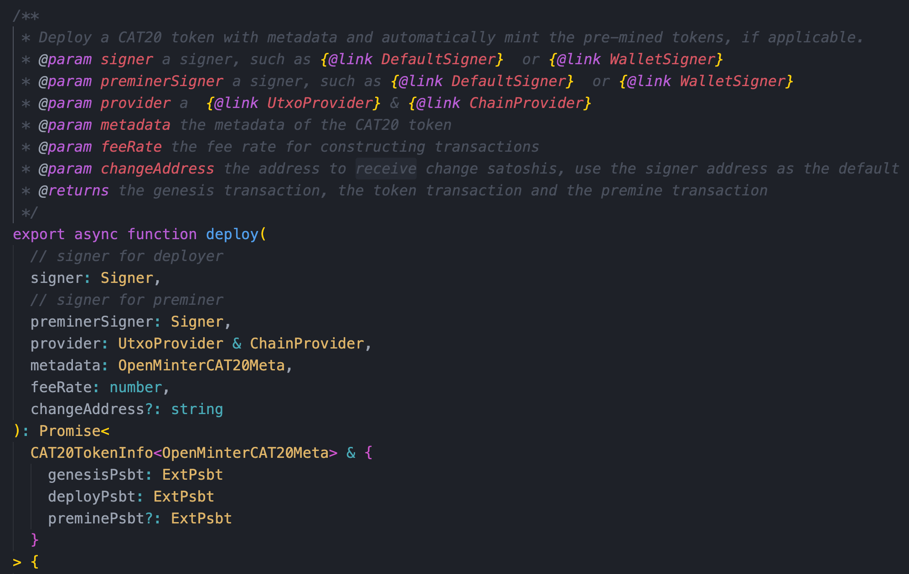

### Design 
The token deployment process involves two transactions: the token genesis transaction and the deploy transaction. We employ a UTXO with data, where the genesis UTXO includes a `CAT` envelope to embed token metadata information.

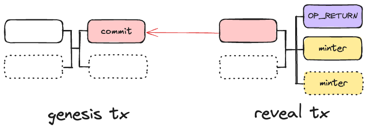

## Mint

### Feature API

To mint CAT20 tokens, you can call the corresponding feature in the SDK:

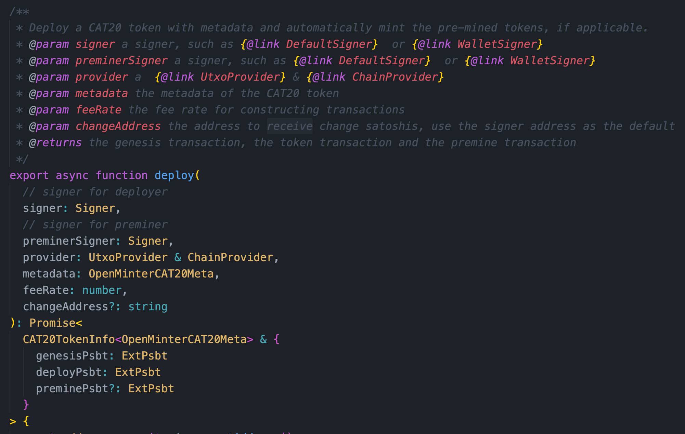

### Design

All minting rules for a token are enforced in its minter smart contract. New tokens are minted by spending a minter UTXO that was first generated in the token reveal transaction. This process can generate new minter UTXOs, which can then be spent to mint more tokens recursively. 

The minter UTXOs are consumed and regenerated throughout the minting process, ensuring that new tokens can only be issued by spending these designated minter UTXOs.

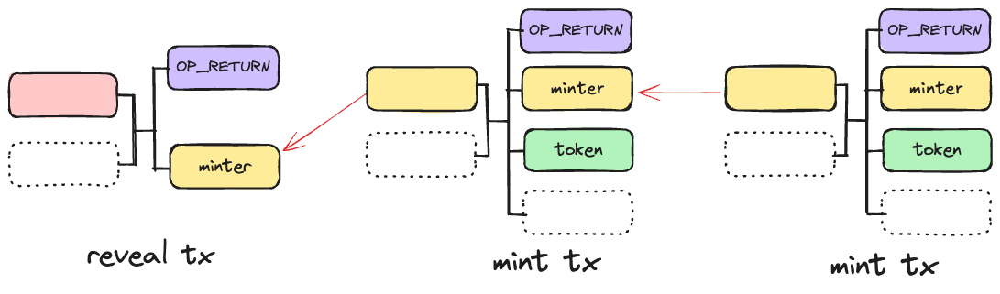

## Send

### Feature API

To send CAT20 tokens, you can call the corresponding feature in the SDK:

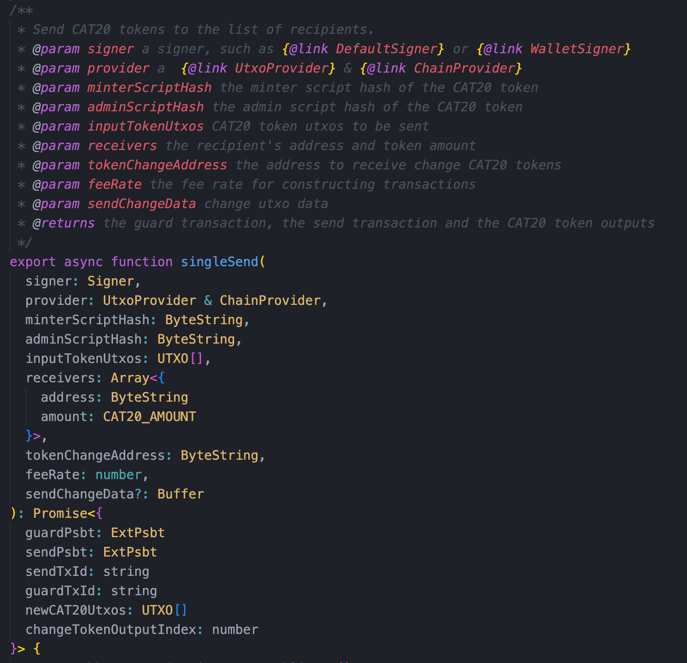

### Design

A fungible token (FT) UTXO can be split into smaller amounts, and multiple token UTXOs can be merged into a single UTXO if they descend from the same genesis transaction. A token transfer transaction can contain multiple token inputs and outputs, which can appear anywhere in the transaction.

Token balance preservation is enforced by miners: the quantity of tokens in the inputs must equal that in the outputs. A guard input `/xferGuard` in the transfer transaction ensures this balance. The Transfer Guard contract can only be unlocked when the token amount remains unchanged between transaction inputs and outputs.

Guard contracts can be customized for different scenarios, allowing you to implement various token amount limitations. This modular approach separates token amount verification logic into a dependent contract rather than hard-coding it directly in the token protocol.
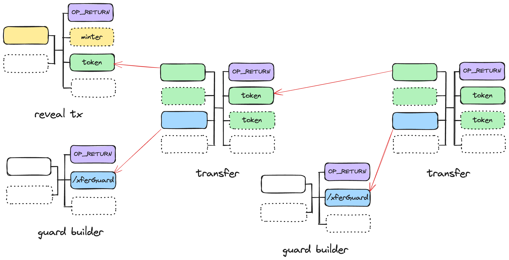

## Burn

### Feature API

To burn CAT20 tokens, you can call the corresponding feature in the SDK:

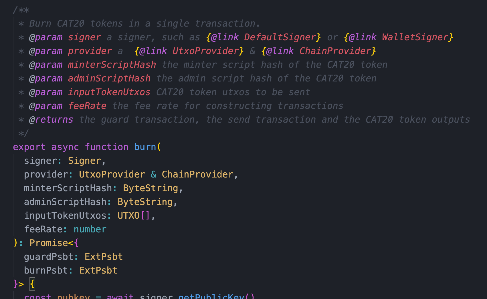

### Design

When tokens are burned, their lineage from the genesis is terminated. The satoshis stored in their UTXOs are "melted" to a regular non-covenant address, effectively "uncoloring" them.

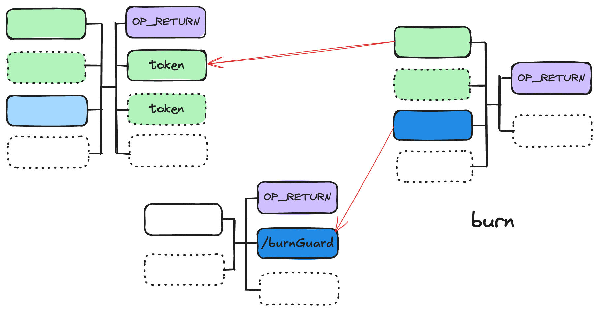

The token burning process is similar to a token transfer, but with the key difference that the tokens are permanently removed from circulation rather than changing ownership.
## Freeze

### Feature API

To freeze CAT20 tokens, you can call the corresponding feature in the SDK:

### Design

Tokens can be frozen using an admin contract, which allows the token issuer to temporarily restrict the transfer of specific tokens when necessary.
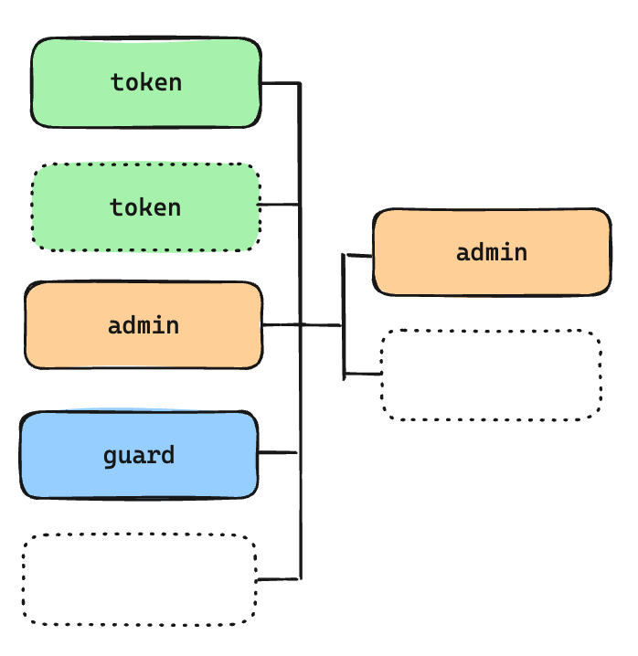

## TransferOwnership

### Feature API

To transfer the owner address of the CAT20 admin contract, you can call the corresponding feature in the SDK:

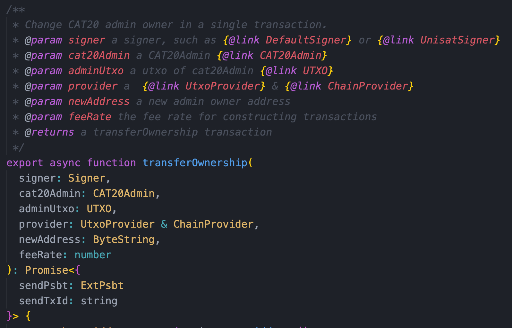

### Design

The ownership transfer feature allows the current owner of the token's admin contract to transfer administrative rights to another address. This enables secure handover of token management capabilities while maintaining the token's integrity and continuity.
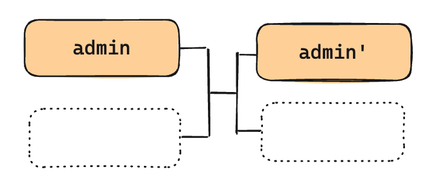