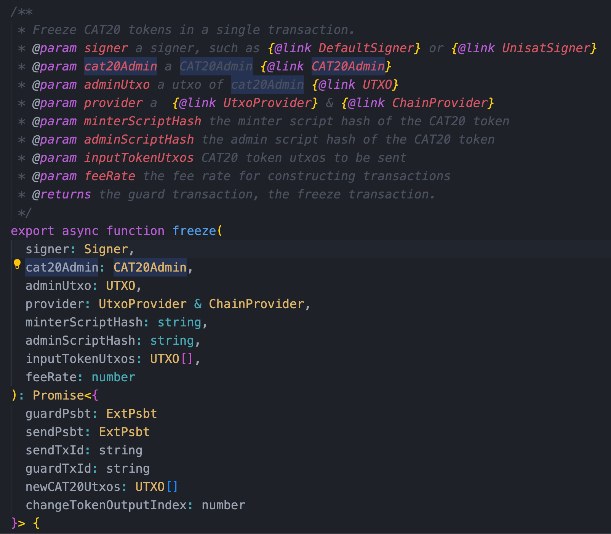

# CAT20

CAT20 standard is a part of the **[Covenant Attested Token (CAT)](https://catprotocol.org/)** protocol which supports fungible tokens. As you all know, CAT is a UTXO-based token protocol that is validated by miners directly and uses smart contracts, specifically covenants, to manage token mints and transfers. It is solely enforced by Bitcoin Script at Layer 1 and has several benefits compared with all the existing token protocols on Bitcoin.

## Deploy

### Feature API

To deploy a new CAT20 token, you can easily call the corresponding feature in the SDK.

### Design 
To deploy a token, we employ a utxo with data. We call the first transaction the token genesis transaction, and the second the deploy transaction. In genesis utxo include a `CAT` envelope to embed token meta information.

## Mint

### Feature API

To mint CAT20 tokens, you can easily call the corresponding feature in the SDK.

### Design

Any rules governing the minting process of a token are enforced in its minter smart contract using covenants. New tokens can be minted by spending a minter UTXO first generated in the token reveal transaction. It can generate new minter UTXOs, which in turn can be spent to mint more tokens recursively. The minter UTXOs are consumed and generated again and again along with the mint processing, and new tokens can only be issued by spending minter UTXOs. 

## Send

### Feature API

To send CAT20 tokens, you can easily call the corresponding feature in the SDK.

### Design

A fungible token (FT) UTXO can be split into small amounts. Multiple token UTXOs can be merged into a single UTXO, if only they descend from the same genesis transaction. In general, there can be multiple token inputs and token outputs in a token transfer transaction, and they can appear anywhere in the transaction.

The preservation of token balance is enforced by miners: the quantity of tokens in the inputs must equal that in the outputs. There is a guard input `/xferGuard` in the transfer transaction. Transfer Guard is a contract, it can only be unlocked when the token amount doesn't change between the transaction inputs and outputs. Note that guard contracts can vary in different situations, and you may design your guard contract as well to implement different token amount limitations. This is the reason why we separate token amount check logic into a dependent contract rather than hard code it directly in the token protocol.

## Burn

### Feature API

To burn CAT20 tokens, you can easily call the corresponding feature in the SDK.

### Design

Tokens can be burned and their lineage from the genesis is terminated. The satoshis stored in their UTXOs are melted to a regular non-covenant address, effectively “uncolored”.

Compared to user transfer tokens, burn token has no big difference, it seems like another kind of transfe.

## Freeze

### Feature API

To freeze CAT20 tokens, you can easily call the corresponding feature in the SDK.

### Design

Tokens can be freeze with admin contract. 

## TransferOwnership

### Feature API

Transfer the owner address of the cat20 admin contract, you can easily call the corresponding feature in the SDK.

### Design

Tokens can be freeze with admin contract. 

