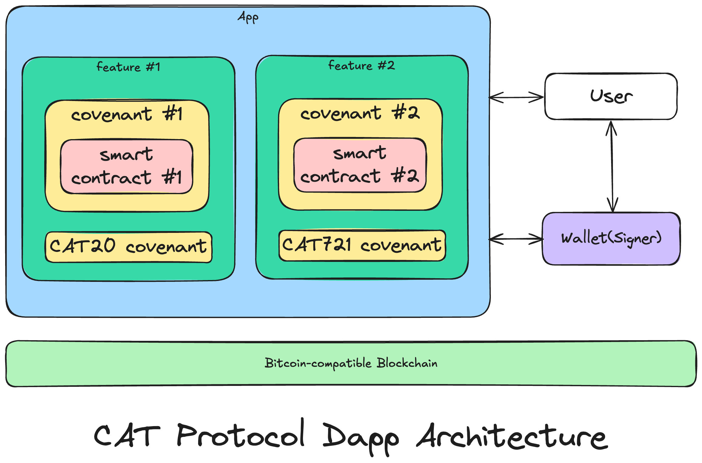

# Overview
Since developing smart contract-based applications on UTXO-model chains is a vastly different experience compared to other account-model chains like Ethereum, certain fundamental principles should be established whenever you intend to build a CAT protocol-based application.

* Design your application’s logic from the very beginning based on the UTXO model.
* The primary function of the layer-1 smart contract is verification, not computation.
* There are still some limitations on the network, so you need to understand how to make trade-offs.

## Installation

You can install the `cat-sdk` by executing this command:

```
npm i @opcat-labs/cat-sdk
```

## Architecture
The CAT protocol is designed to work on the OP_CAT layer network.
To construct decentralized applications based on the CAT protocol, here's our recommended architecture design.



### App
Let’s begin with the idea that you’re planning to develop an app with certain features that enable users to interact with CAT20 or CAT721 tokens.

### Signer
Since there are many wallets that your app wants to allow users to connect to, you can just use interfaces of `Signer` to simplify the process of signing transactions. By abstracting the wallet as the signer, the application can be decoupled from the implementation of signing transactions from specific wallets.

### Feature
Your app or library can offer some features that can be easily accessed through simple APIs by other parts of your application or even third-party developers without revealing the intricate details of the underlying structure of transactions, covenants, and so on. For instance, if you want to provide a feature, you might need to write some code within your feature function to handle transaction creation, signing, and broadcasting, as well as UTXO management tasks. This could involve multiple transactions and covenants within a single feature.


### Smart Contract
By simply using sCrypt’s DSL, you can effortlessly write smart contracts. In general terms, an sCrypt smart contract represents how you want to control the spending conditions of a specific UTXO. Unlike the concept of “covenant,” you can treat smart contracts as Bitcoin script that you can read and write without having to grapple with the steep learning curve of the Bitcoin Stack-based virtual machine. 

### Bitcoin Script
All of the sCrypt smart contracts would be compiled into Bitcoin scripts and included in the corresponding transactions. These scripts would then be verified by miners when they include these transactions in blocks.


## SDK Summary

The `cat-sdk` offers some useful APIs that can be used when building applications. Additionally, it provides a good example that adheres to the architecture design previously discussed.

* Features: On a high level, this SDK offers some fundamental functionalities to interact with CAT20 and CAT721 protocol tokens, including Deploy, Mint, Transfer, Burn, and Freeze. These APIs can be found in the [src/features](https://github.com/OPCAT-Labs/ts-tools/tree/main/packages/cat-sdk/src/features) folder.


* Smart Contracts: On a fundamental level, this SDK offers all the essential smart contracts written in the sCrypt DSL, which can be compiled into Bitcoin scripts. If you’re interested in learning how to create your own on-chain smart contracts, you should thoroughly examine these contracts in the [src/contracts](https://github.com/OPCAT-Labs/ts-tools/tree/main/packages/cat-sdk/src/contracts) folder.

You can access the source code of the SDK from [here](https://github.com/OPCAT-Labs/ts-tools/tree/main/packages/cat-sdk). We hope you had a wonderful journey with the CAT protocol.


